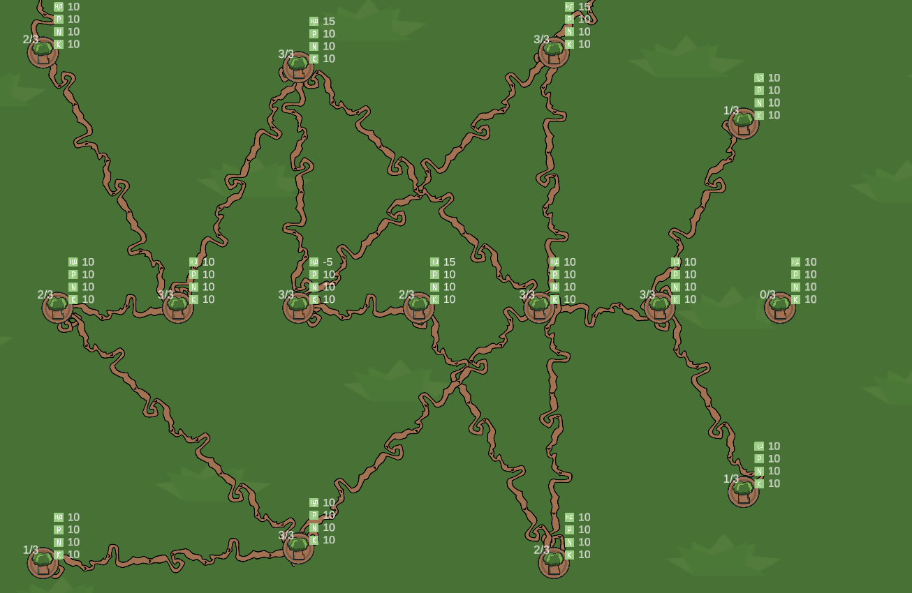

# Wood Wide Web!
## Game Description
In this strategic puzzle game, players take on the role of a forest keeper tasked with connecting trees to create a thriving ecosystem. Each tree has a limited number of connections, and players must carefully manage their resources to make each connection successful. The goal of the game is to conquer special trees and expand the player's network, challenging their puzzle-solving skills and resource management abilities. With immersive graphics and thought-provoking gameplay, this game will captivate players for hours.

-- description generated by ChatGPT

## Screenshot

